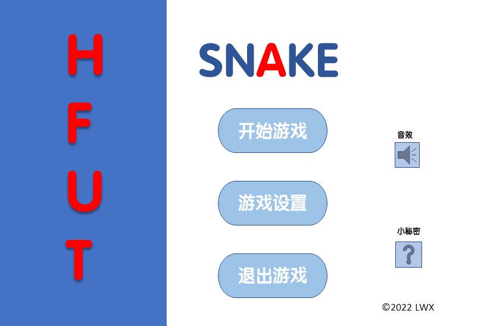
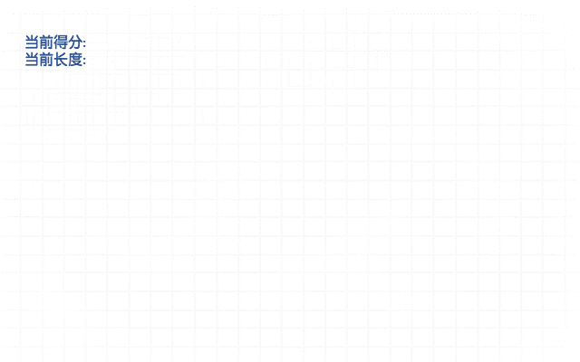
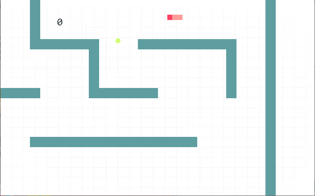
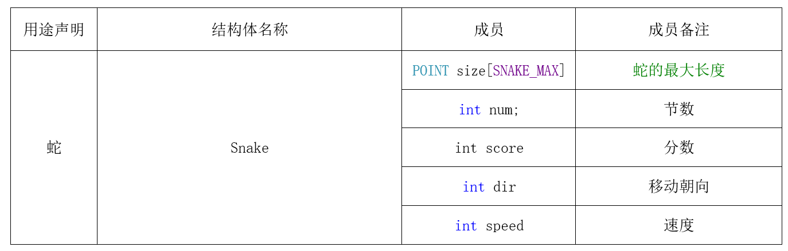
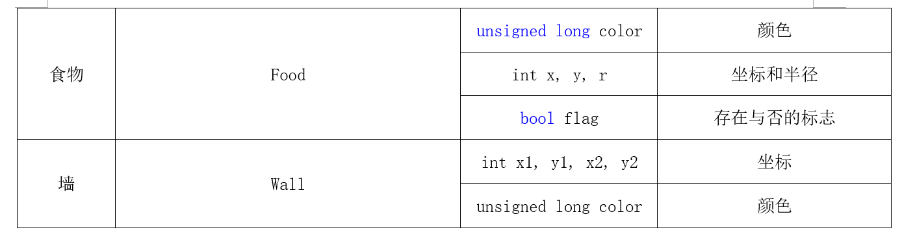

# 贪吃蛇小游戏

## 写在前面

​	此项目是我大二上的C++程序的课程设计小Demo, 当时完成的时候成就感满满, 现在来看确实有一点点low了。项目整体代码量不大, 一千行多点, 费心思的地方应该是UI部分了, 为了图方面使用PPT完成了界面的绘制, 然后通过EasyX的一些库函数进行相关逻辑的判断, 进而执行相关的功能。

​	当时的课程设计要求如下: 

> 游戏规则为：
>
> 1. 游戏开始时，在游戏区域固定位置出现贪吃蛇，随机的在区域内某个位置出现食物。
>
> 2. 贪吃蛇会自动沿着其头部的方向移动。
>
> 3. 玩家可以做的操作有：键盘控制蛇的上下左右移动。
>
> 4. 当蛇遇到食物时，会把当前食物吃掉，并成为玩家的得分，新的食物会随机出现在区域内的某个位置上。
>
> 5. 当蛇遇到墙壁时，游戏结束。
>
> 加分部分：
>
> 1. 可以考虑增加关卡，不同的关卡，难度不同，例如蛇的移动速度增加等等。
>
> 2. 可以在游戏区域内增加障碍物，蛇碰到障碍物后游戏结束。
>
> 3. 在游戏区域增加障碍物的基础上，可以考虑让蛇在某种条件下能够毁坏障碍物，例如蛇吃掉某种特殊的食物后，具有暂时毁坏障碍物的能力。

##  项目UI展示

### 主界面

### 无尽模式

### 关卡模式

### 游戏失败

## 代码构思

### 运行环境说明

Environment : Visual Studio 2019 (Community) 

Notice   : EasyX [Version: 2021-11-09] 

### 结构体设计

### 函数设计

void menuInit();                 // 菜单界面

void secret();                   // 小秘密界面

void gameExit();                // 退出游戏

void gameOver();               // 游戏结束

bool isShowGrid();               //游戏界面是否显示网格

void showLenth(int len);          // 显示长度

void showScore(int score);        // 显示分数

void Eat();                  // 吃食物, 得分(取决于半径大小1, 2, 3, 4), 重新随机生成食

void keyControl();               // 按键交互

bool isAcceleration();            // 判断是否加速

bool snakeMove1();              // 普通模式判断是否能移动蛇

bool snakeMove2();              // 无尽模式和关卡模式判断是否能移动蛇

void gameInit1();                // 普通模式和无尽模式初始化

void gameInit2();                // 关卡初始化

void wallDraw();                 // 画墙

void lineDraw();                 // 画网格线

void gameDraw1();              // 普通模式

void gameDraw2();              // 无尽模式

void gameDraw3();              // 关卡模式

int getScore();                   // 获取分数

int getLen();                    // 获取长度

### 图形库函数

mciSendString(TEXT("open GameMusic.mp3"), NULL, 0, NULL); //播放音乐

mciSendString("play GameMusic.mp3", NULL, 0, NULL);   //关闭音乐

GetMouseMsg();   //获取鼠标信息

BeginBatchDraw(); //开始批量绘制

EndBatchDraw();   //结束批量绘制

initgraph(WIDTH, HIGHT);   //打开界面

loadimage(&image_begin, "开始界面.png", WIDTH, HIGHT);   //加载图片

putimage(0, 0, &image_begin);   //导入图片

setbkmode(TRANSPARENT); //设置背景模式

setlinestyle(PS_SOLID, 1, NULL, 0);     //设置线的风格

setlinecolor(BLACK);    //设置线的颜色

settextstyle(26, 0, _T("Consolas")); //设置字体的宽+字体的高+字体的风格

settextcolor(RGB(66, 76, 78));     //设置文本颜色

sprintf(s, "%d", score);  //输出文本

outtextxy(115, 32, s);   // 输出文本

_kbhit()  //判断有无输入

GetAsyncKeyState(VK_SPACE)    // 获取是否有其他按键

setfillcolor(RGB(95, 158, 160));    //设置填充颜色

solidrectangle()    //实心矩形

solidcircle()   //实心圆

### 遇到的小问题

1.  解决VS中对函数内存做边界,内存越界等问题的检查

   \#define _CRT_SECURE_NO_WARNINGS

2. 鼠标结构体MOUSEMSG在图中像素位置的确定:

   使用画图工具, QQ的截图功能

3. UI的设计

   直接使用PPT把UI设计出来, easyx的文字不好控制, 图形比较丑

4. 关卡的设定

   直接在画图工具上画出想要的关卡, 但苦于关卡跳转出了BUG, 没能实现这一功能

5. 解决outtextxy文字报错问题

   Visual studio需要在项目的高级功能处将字符集改为 ”使用多字节字符集”

6. 解决蛇加速和暂停问题

   设置蛇加速的函数, 使用异步键盘的函数, (GetAsyncKeyState(VK_SPACE) & 0x8000)解决这一问题, 并通过Sleep()函数的不同刷新值来实现这一效果, 而暂停功能就是按键交互实现的

7. 解决无尽模式中蛇穿墙功能

   让蛇头瞬间移动到边界的另外一处, 直接坐标交换。就和蛇自身更新一样, 然后就完成了。

8. 解决返回的问题

​	还是同样用MOUSEMSG, 只不过是在那张图片中再加一个死循环, 直到我点到了那个位置才让它有下一步的操作。

## 待完善的功能

​	对不同半径的食物做出的反应, 游戏界面中对游戏的设置未完成, 关卡的跳转, 图形界面的优化, 代码书写和注释的规范。吃食物时会闪现一个点、边界问题没有做好、不能存档读档, 没能利用学到的文件的知识设置一个排行榜等等

## 小小心得

​	虽然贪吃蛇是个简单的小游戏，但是当我第一次写出自己敲出的代码，还是成就感满满。对编程语言知识的理解其实也是一个很好的巩固。第一次自己去主动学习这么多的新语法、完成了第一个工程文件的基本构建，还成功结合了自己会的其他软件（UI设计方面）。

​	总体来说，这次课程设计带给我的提升，不是一言两语能说清的。因为做这个游戏的时候发生了许多困难，所以做的过程中多少也有所感动，猜测了很多未来会发生的事情。希望自己的进步不止于此，而是不断地去发掘更多的潜力，让未来的自己打开这个稚嫩的程序时，真的会露出宠溺的微笑吧。

